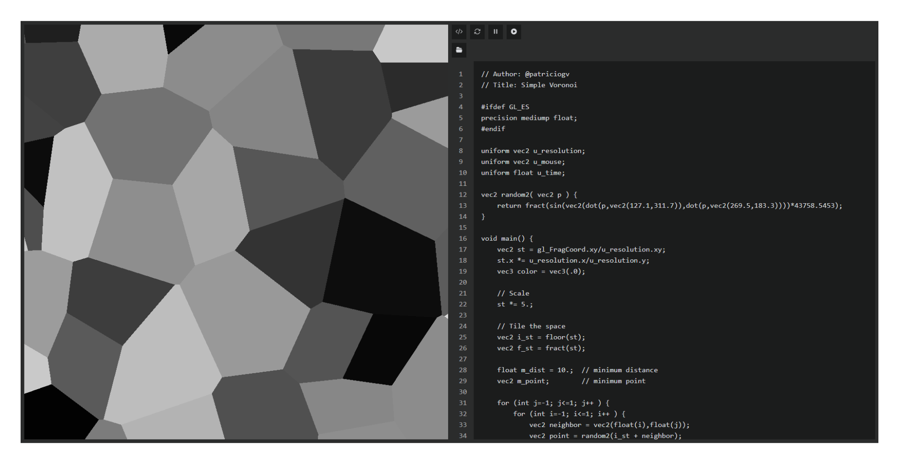

# shadewithseal

**seal** is a local tool for creating, storing and recording glsl fragment shaders directly in your browser.  
No internet connection or installation required — just download the html file and it will open as a web page.

Built for artists and coders who need a lightweight playground to prototype and archive shaders. Ideal for those who prefer simplicity, privacy and control. Not for highly specific professional use but some edge-cases are covered.

All your data stays on your machine without accounts, servers or sync. Just remember to export frequently and before deleting browser data.

## Features

**seal** is stable and functional, aimed at staying minimal: just open the latest html released and start working.

* **Live-coding**: Write GLSL fragment shaders and see results in real time with error logs on top of the canvas.
* **Rendering**: Simple and minimal rendering loop powered by native webgl. Support for most shadertoy custom variables.
* **Recording**: Play, pause, restart, record and download the shader as a .webm video with one click (square aspect ratio).
* **Local Saving**: Organize your shaders in folders and store them in your browser using indexedDB.

**WIP**: indexedDB JSON export > Overlapping multiple shaders with blending modes > Custom aspect ratios

Remember that **your data stays in the browser until you export it!** - back it up regularly if needed.

Pro tip: *save as bookmark for easy access!*

---

  <strong><em>designed with simplicity in mind, to keep you in control</em></strong>
    
  

